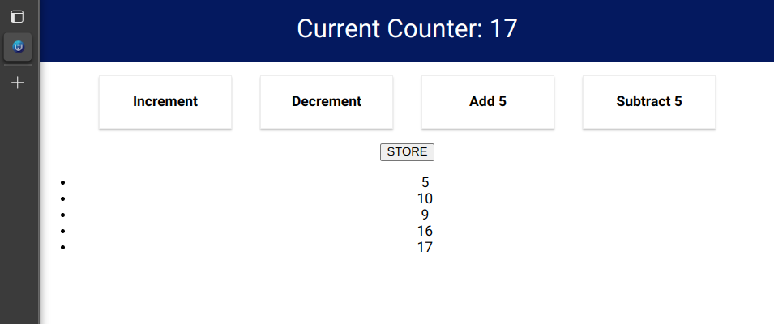

<p align='center'>

</p>

# React Counter App with Redux Toolkit

A simple React app named <strong>Counter</strong> showcasing Redux for state management.

## Features
- Basic increment and decrement buttons.
- Increment and decrement by five buttons.
- Store button to save the counter value in a history list.
- Clicking on a history item removes it.

## Getting Started
```bash
git clone https://github.com/hassan-arif/counter.git
cd counter
npm install # includes react-redux, @reduxjs/toolkit
npm start
```
Open [http://localhost:3000](http://localhost:3000) to view it in your browser.

## Screenshots

<p align='center'>
  
  <br/>
  
</p>

## Contributing
Contributions are welcome! Please fork the repository and create a pull request for any bug fixes or improvements.